## 简介
针对webpack站点，爬取网站JS文件，分析获取接口列表，自动结合指纹识别和fuzz获取正确api根，可指定api根地址（针对前后端分离项目，可指定后端接口地址），根据有效api根组合爬取到的接口进行自动化请求，发现未授权/敏感信息泄露，回显api响应，定位敏感信息、敏感文件、敏感接口。支持批量模式。支持需认证接口自动尝试bypass。

## 流程图
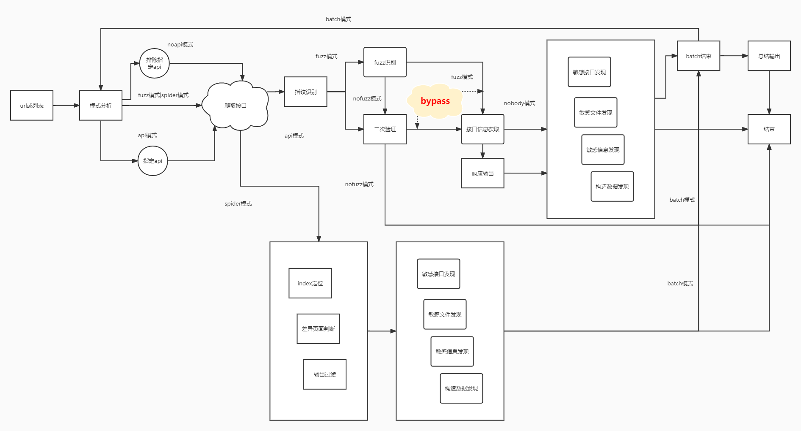

## 使用
环境:

python3.8

安装依赖:

`pip3 install -r requirements.txt`
### 快捷命令

`alias jjjjjjjjjjjjjs='python3 jjjjjjjjjjjjjs.py'`

### 使用方式
```
使用方式：python3 jjjjjjjs.py url|urlfile [fuzz|api] [noapi] [nobody|nofuzz] [cookie] [header] [danger] [bypass] [thread]

url|file:目标url

fuzz:自动fuzz接口

api:用户指定api根路径  fuzz|api eg. api=/jeecg-boot

noapi:排除输入的指定api eg. noapi=/system,/worker,/api

nobody: 禁用输出响应body   nobody|nofuzz

nofuzz: 仅获取有效api，无后续响应获取

cookie: 设置cookie（爬取阶段和响应获取阶段）eg. cookie='username=admin'

header: 设置header（爬取阶段和响应获取阶段）eg. header='X-Forwarded-For: localhost\nX-Access-Token: eyJxxxxx'

danger: 解除危险接口限制

bypass: 对500 401 403 进行bypass测试（bypass模式响应获取阶段会忽略cookie和header）

thread: 线程数（爬取阶段和响应获取阶段）eg. thread=200
```
> 注意: 目标参数的位置固定在参数第一位，其他参数不限制出现位置

### 示例
爬取模式

`python3 jjjjjjjjjjjjjs.py  http://192.168.189.133:3000`

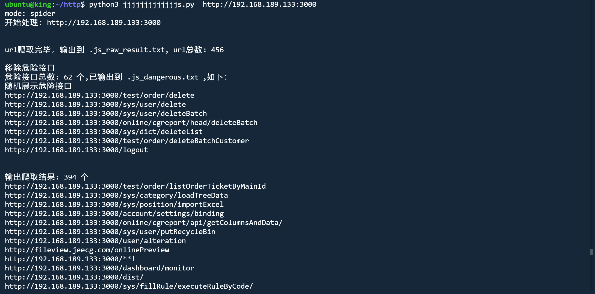

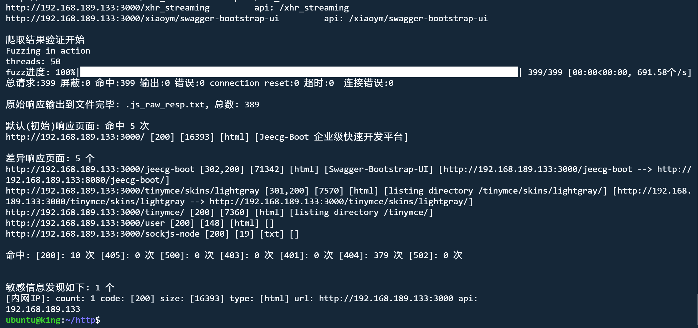

fuzz模式 nobody

`python3 jjjjjjjjjjjjjs.py  http://192.168.189.133:3000 fuzz nobody`

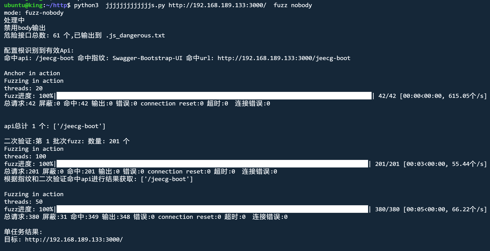

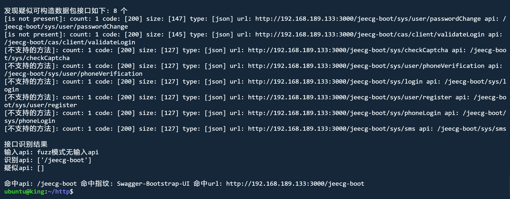

api模式 nofuzz

`python3 jjjjjjjjjjjjjs.py  http://192.168.189.133:3000 api nofuzz`

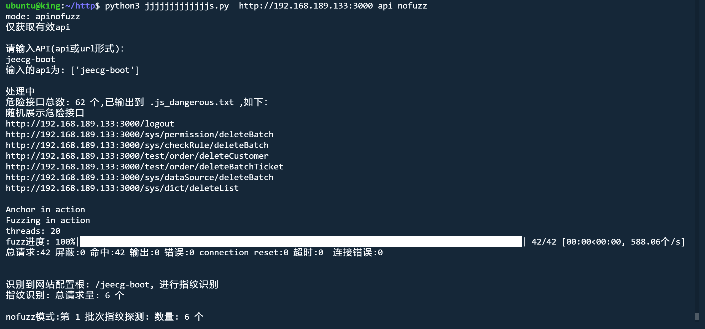

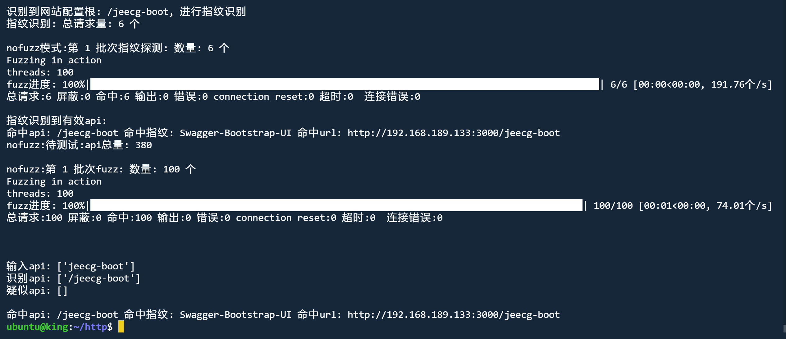

api模式 nobody header

`python3  jjjjjjjjjjjjjs.py http://192.168.189.133:3000/  api   nobody  header='X-Access-Token:eyJxxx'`

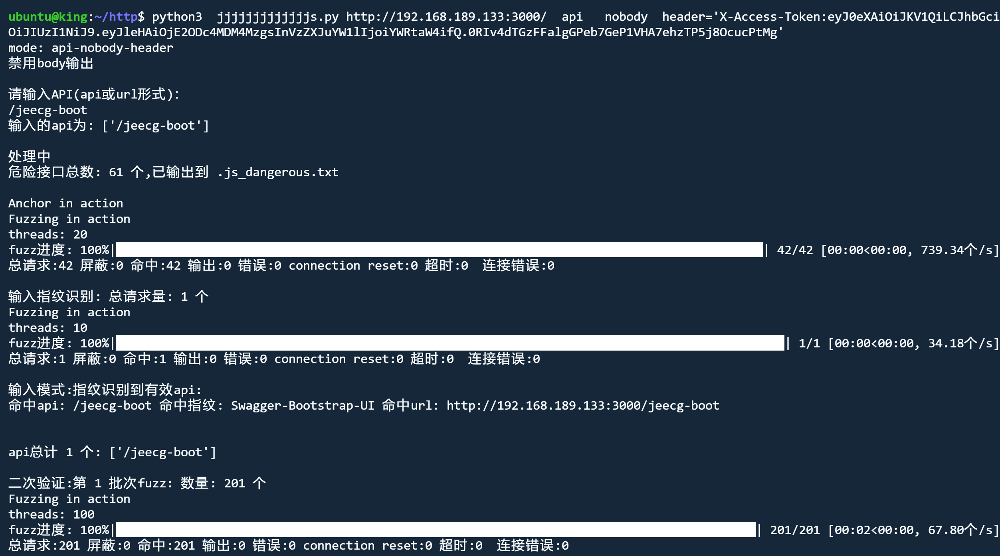

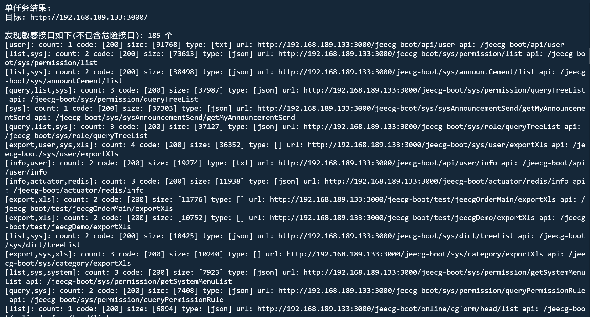

### bypass模式 自动实施常见bypass

fuzz模式 nobody bypass

`python3  jjjjjjjjjjjjjs.py http://192.168.189.133:3000/  fuzz  nobody   bypass`

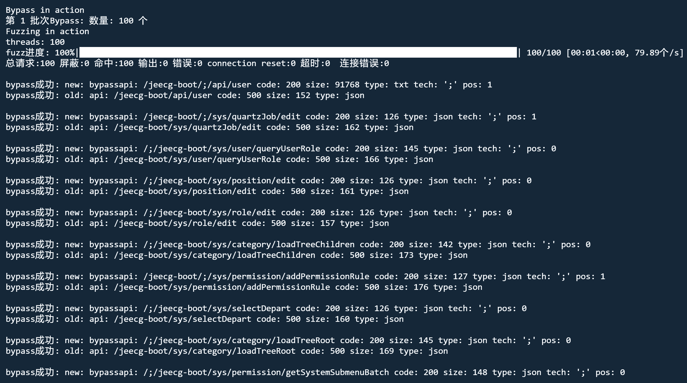

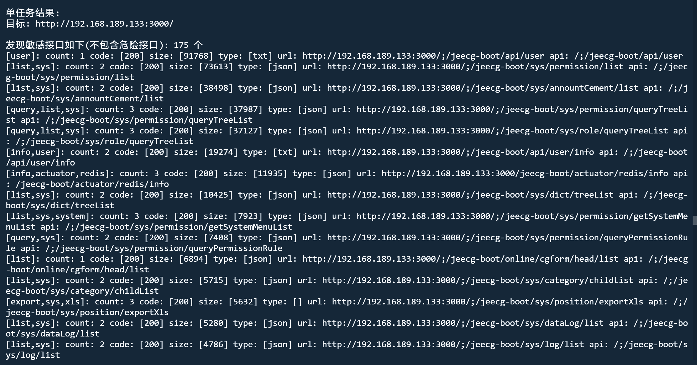

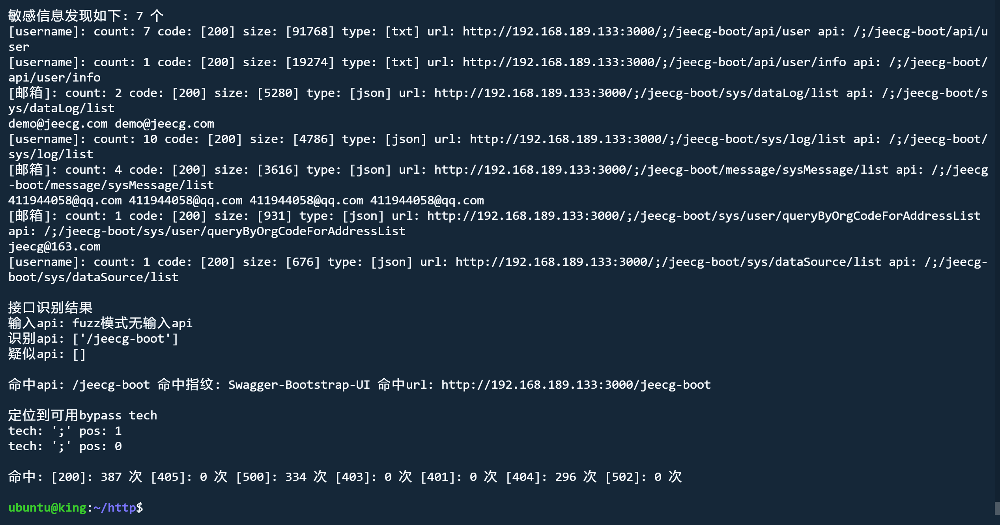

danger模式 解除危险接口限制

`python3  jjjjjjjjjjjjjs.py http://192.168.189.133:3000/  fuzz  nobody   danger`

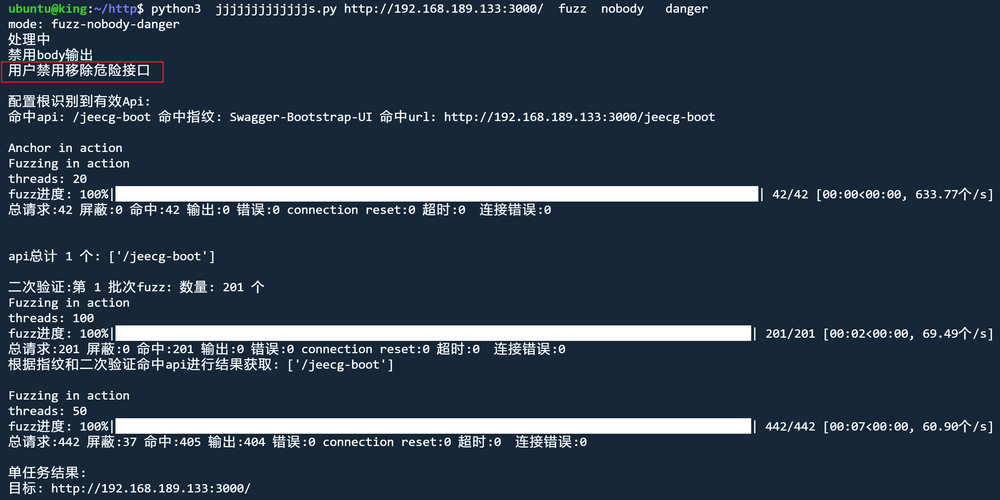

## 致敬

接口爬取部分，对老版本的URLFinder中的爬取方法进行了Python实现 https://github.com/pingc0y/URLFinder

敏感信息部分正则“借用了” key师傅HaE中的正则 https://github.com/gh0stkey/HaE

另外也参考了 https://github.com/momosecurity/FindSomething

再次感谢师傅们 师傅们太强了 yyds

https://github.com/pingc0y/URLFinder

https://github.com/gh0stkey/HaE

https://github.com/momosecurity/FindSomething

https://github.com/Str1am/Auto_JsFinder

https://github.com/Threezh1/JSFinder

https://github.com/GerbenJavado/LinkFinder

